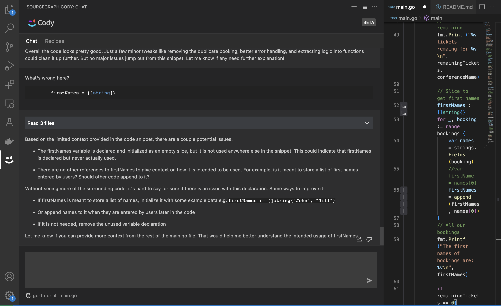

# Learning Golang
I'm taking a beginner course on Golang by [TechWorld With Nana](https://youtu.be/yyUHQIec83I). I'm also using [Sourcegraph Cody](https://docs.sourcegraph.com/cody) as an AI pair assistant to ask questions and improve my code when I run into issues.

# Sourcegraph Cody in Action
Selected a line of code and prompted it for more context on the error *"What's wrong here?"*

Another example: 

